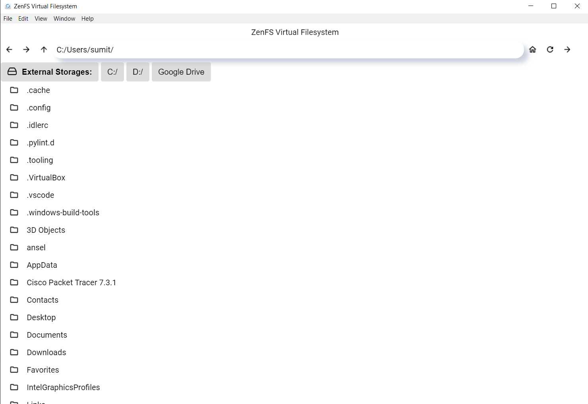

<h1>ZenFS- A Virtual File Sytem</h1>

<p> ZenFS is a virtual file system built using Electron access your files and folders easily with an accessibility in the form of audio feedback after every task performed and even an audio response over all the UI Elements.</p>

<h3> Get Started! </h3>

<p> Clone this repository to you local machine using the command below:</p>
```
git clone https://github.com/HNGP/ZenFS.git
```
<p>Once cloned, use cd to change into the ZenFS directory. Then hit the command below to install all of the dependencies. </p>
```
npm install
```
<p>Then, to start the application use this command and the app will open in a separate window </p>

```
npm start
```

<h2>Screenshots</h2>
<li><h4> Windows </h4></li>

